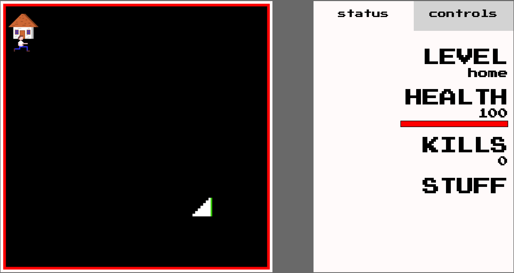
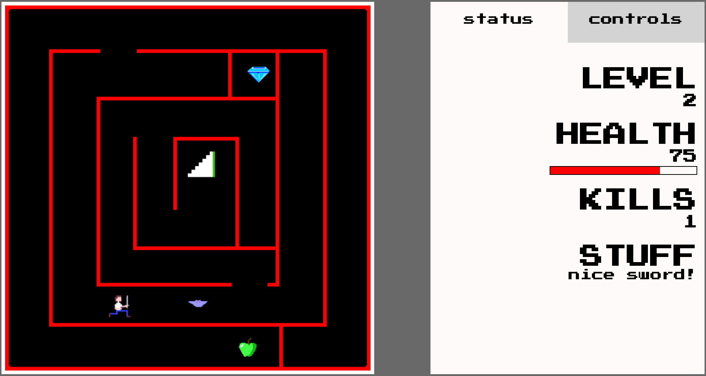
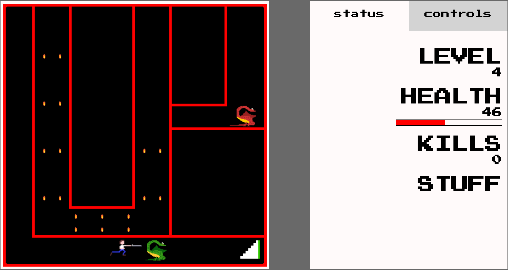
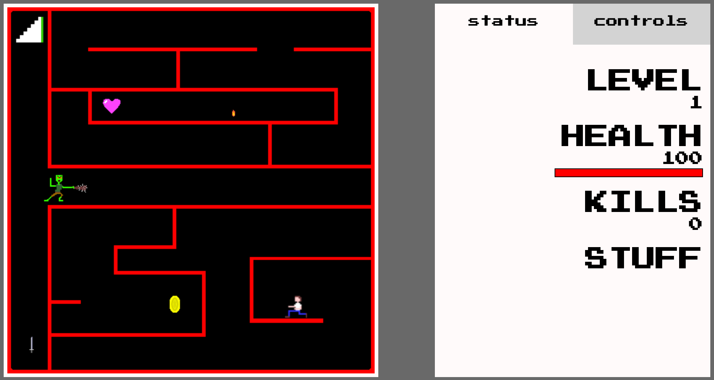
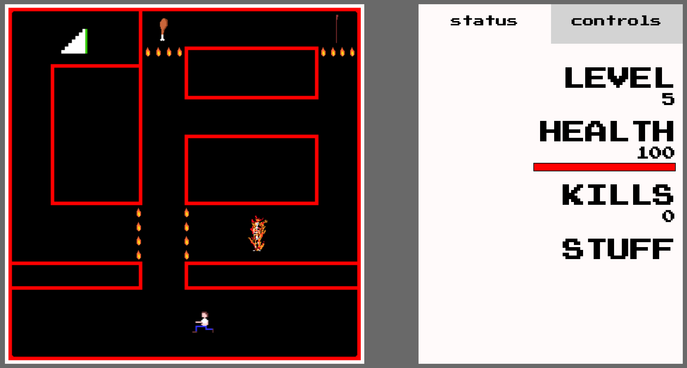

This is a JavaScript 8-bit Diablo-style dungeon explorer.  This game was programmed mostly using HTML5's Canvas element, with some jQuery DOM manipulation to show the stats in the menu.

## Collision Detection
The collision detecting for the walls is done by color.  I wanted to write it this way so it would be easy to draw new levels and just drop them in without having to worry about plotting wall coordinates.  It is built in to the movement function for the main character.  

### getImageData
getImageData is a method on Canvas that returns the rgba value of pixels for a defined area as an array.  The movement function calls this method on the pixels the character is about to move to before it allows him to move there.  If the method returns any pixels that have an rgb value of (255, 0, 0) then the character isn't allowed to move in that direction.

## Keyboard

They keyboard controls are set up by creating an empty keysDown array to store key code values.  Then the keyboard listeners add a true value at the index number of the keysDown array.  That way you can add new controls easily by calling a function if the keysDown array returns a true value at whatever key code you are listening for.

## Attacking
The attacking is done by changing the source image for the characters.  If the source image is the attacking version, it will hand out damage to an enemy that is within range.

### requestAnimationFrame
The core of the game is the main()  loop, which has three basic components.  First, runs a function that updates the positions of all of the objects that need to be drawn on the canvas.  Second, runs a function that renders all of said objects.  Finally, it calls requestAnimationFrame, which again calls main(), causing the function to loop, and thus the illusion of movement is achieved.  

# NEAT!
